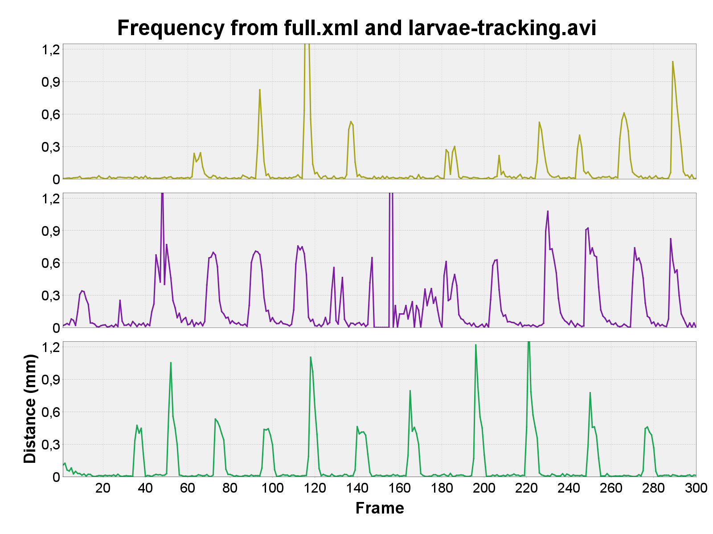

# Extract Frequency Data

## Interface
{ width="400em" }

## XML File
!!! warning "Tracking Required"
    Note that this function **depends on the previous use of Trackmate** to gather data about movement frequency, so files without them will get rejected.

Two possible files can be used here:

1. Trackmate's whole save file
2. Output of trackmate's `Export tracks to XML file` export action.

--8<-- "source-video-analysis.md"

## Fix Missing Spots
When tracking with Trackmate, not all frames in a video will have spots. That's because your target might not be visible in those frames. It's usually not moving as well. An uneven number of frames will create an unreliable score overall. This option fixes the missing spots by using an available adjacent spot and copying its coordinates.

There's no prejudice in setting this to `True` if you have a perfect tracking, with spots in all frames.

If you have only spots and no tracks, this feature won't work in this mode. It is not significant to mean out the positions of scores on each frame; thus, this checkbox gets deactivated if this is the case.

## Display Plots
* **Line Chart**: Composed chart to display displacement over time.
  { width="400em" }
