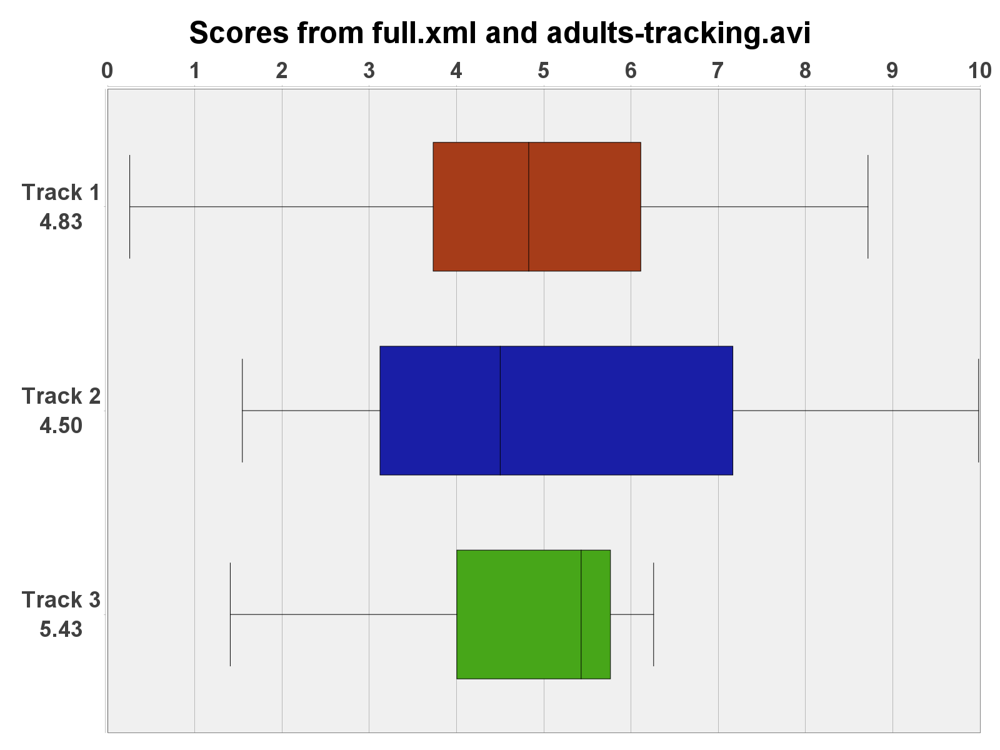

# Calculate Score Gradient

From user-defined min and max values, calculates a score (0-10) of each spot from Trackmate.

--8<-- "excel-functions.md"

## Interface
{ width="400em" }

## XML File
Two possible files can be used here:

1. Trackmate's whole save file
    * Ideal option overall.
    * Mandatory if you only have spots and no tracks. In this case, a mean score of every spot on each frame will be calculated.
    * **If there are any tracks, all spots outside them will get filtered out.** 
2. Output of trackmate's `Export tracks to XML file` export action.
    * Only spots in tracks get saved in this file, so only them will be considered.

--8<-- "source-video-analysis.md"

## Fix Missing Spots
When tracking with Trackmate, not all frames in a video will have spots. That's because your target might not be visible in those frames. It's usually not moving as well. An uneven number of frames will create an unreliable score overall. This option fixes the missing spots by using an available adjacent spot and copying its coordinates.

There's no prejudice in setting this to `True` if you have a perfect tracking, with spots in all frames.

## Display Plots
   * **Box Chart**: The starting edge of the box corresponds to the 1st Quartile (Q1, 25th percentile), and the ending edge corresponds to the 3rd Quartile (Q3, 75th percentile). The line crossing through the interior of the box indicates the Median (Q2). The whiskers reach the lowest and highest data points that are within 1.5 times the IQR from the box edges.
     { width="400em" }
   * **Dial Chart**: Dial is set to the median score value. (If you have multiple tracks, montage of all track's dials is created)
     
     { width="400em" }

--8<-- "open-frame.md"

## Load Min/Max from XML
Gathers and displays the min and max position values from the current XML.
It is required to click this button to check for calibration issues.

## Change Max Score
Allows the user to change the max value by clicking on the preview image.

## Change Min Score
Allows the user to change the min value by clicking on the preview image.

## Stop
Stop changing max and min values.