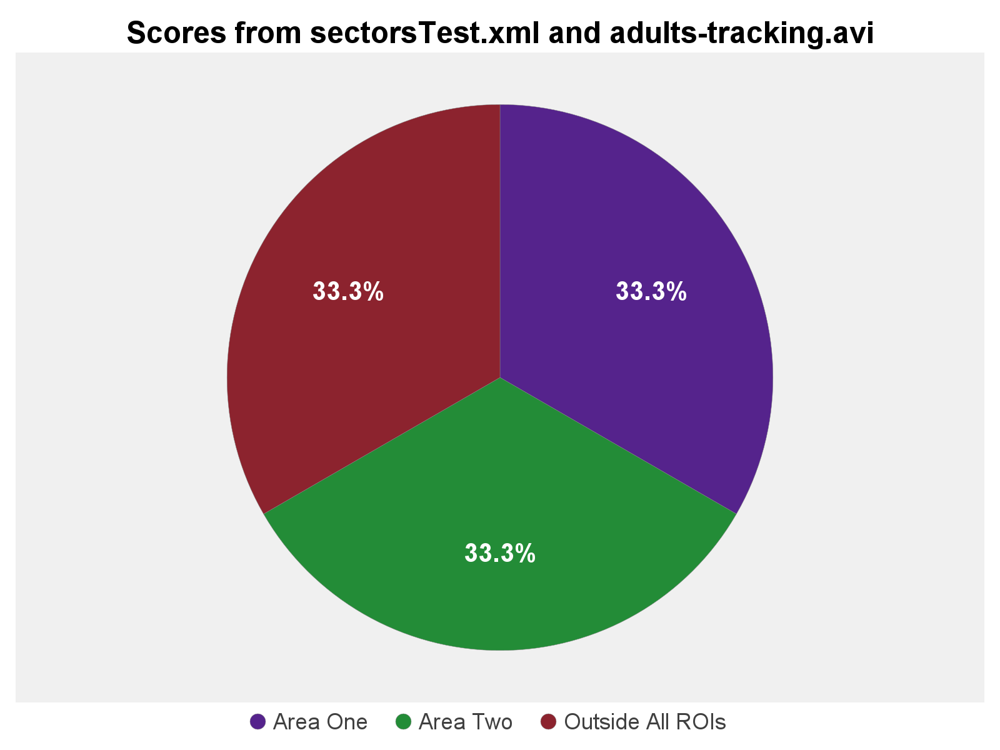

# Calculate Score Sectors

--8<-- "excel-functions.md"

## Interface
{ width="400em" }

## XML File
Two possible files can be used here:

1. Trackmate's whole save file
    * Ideal option overall.
    * Mandatory if you only have spots and no tracks. In this case, spots will be considered as-is, without fixing missing spots.
    * **If there are any tracks, all spots outside them will get filtered out.**
2. Output of trackmate's `Export tracks to XML file` export action.
    * Only spots in tracks get saved in this file, so only them will be considered.

--8<-- "source-video-analysis.md"

## Fix Missing Spots
When tracking with Trackmate, not all frames in a video will have spots. That's because your target might not be visible in those frames. It's usually not moving as well. An uneven number of frames will create an unreliable score overall. This option fixes the missing spots by using an available adjacent spot and copying its coordinates.

There's no prejudice in setting this to `True` if you have a perfect tracking, with spots in all frames.

If you have only spots and no tracks, this feature won't work in this mode. It is not significant to mean out the positions of scores on each frame; thus, this checkbox gets deactivated if this is the case.

## Display Plots
* **Pie Chart**: Simple chart to represent spot prevalence in different areas by percentage.
  { width="400em" }
