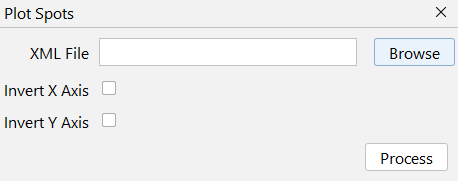
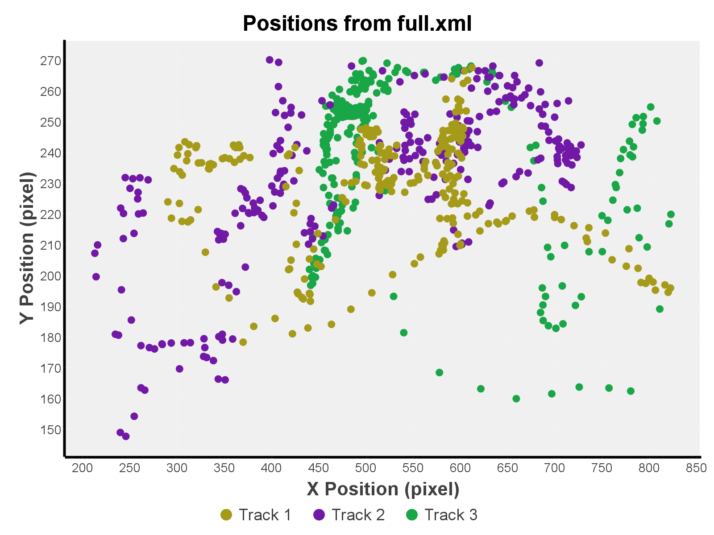

# Plot Spots

Extract spots position data from a given Trackmate file. Outputs a scatter plot and a results table.

[//]: # (TODO: finish this)


## Interface
{ width="400em" }

## XML File
Two possible files can be used here:

1. Trackmate's whole save file
    * Ideal option overall.
    * Mandatory if you only have spots and no tracks. In this case, spots will be considered as-is, without fixing missing spots.
    * **If there are any tracks, all spots outside them will get filtered out.**
2. Output of trackmate's `Export tracks to XML file` export action.
    * Only spots in tracks get saved in this file, so only them will be considered.



## Output
* **Scatter Chart**: Simple chart to represent spot positions.
  { width="400em" }

[//]: # (TODO: this)
[How to reproduce this?](../guide/reproducibility.md#plot-spots){ .md-button }