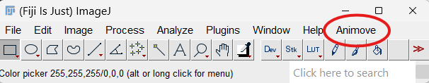

# Quick Start

Animove is displayed in the upper-right area of Fiji's menu bar.

{ width="400em" }

File requirements are available in each function description. 

## Workflows and Processes

Refer to this documentation's [reproducibility section](reproducibility.md) for a thorough step-bey-step guide.

--8<-- "test-data.md"

## Grayscale Converting Disclaimer
All RGB videos get converted to grayscale for processing. All image channels will get merged into a single one.

The conversion is [handled by OpenCV](https://docs.opencv.org/4.12.0/de/d25/imgproc_color_conversions.html), using the proportions: 0.114 * B + 0.587 * G + 0.229 * R

These are the same proportions ImageJ uses in [AVI_Reader](https://github.com/imagej/ImageJ/blob/master/ij/plugin/AVI_Reader.java) and ColorProcessor conversions.

