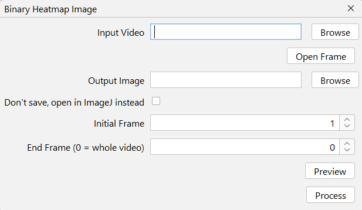

# Binary Heatmap Image

Generates a binary heatmap image. Processing steps:

* **Heatmap Generation** Iterates through the video frames, performing a Otsu automatic threshold to binarize the frames, then aggregates them using a minimum Z-Projection.

* **Background Reference Creation:** Performs a second iteration over the frames to calculate the Average Z-projection of the raw footage.

* **Final Composition:** Binarizes and inverts the generated average image (using the same method), then adds it mathematically to the binary heatmap to produce the final result.

## Interface
{ width="300em" }

## Expected Output

{ width="400em" }

--8<-- "input-video.md"

--8<-- "open-frame.md"

--8<-- "output-image.md"

--8<-- "dont-save.md"

--8<-- "start-end-frame.md"

--8<-- "preview.md"