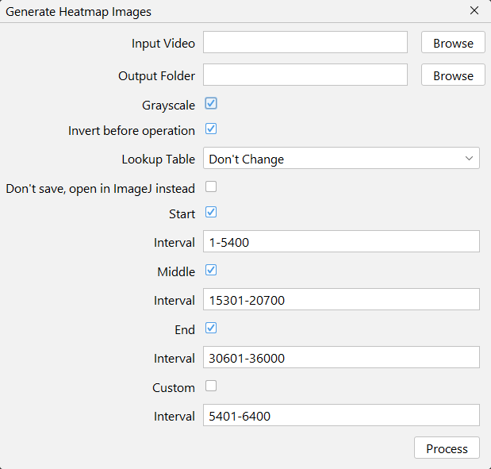

# Sum Heatmap Images

Generates an image using pixelwise addition of the selected frames. Processing steps:

* **Heatmap Generation** Iterates through the video frames, performing a Otsu automatic threshold to binarize the frames, then aggregates them using a minimum Z-Projection.
  
* **Background Reference Creation:** Performs a second iteration over the frames to calculate the Average Z-projection of the raw footage.

* **Final Composition:** Inverts the generated average image and applies the selected Lookup table (LUT).

<!--
info: 
esse é o fluxograma dessa macro:
selectImage(fullStackID);
run("Duplicate...", "duplicate range="+intervals[i]);
sliceID = getImageID();
selectImage(sliceID);

run("Invert", "stack");
run("Z Project...", "projection=[Average Intensity]");
avrID = getImageID();

imageCalculator("Subtract create stack", sliceID, avrID);
run("Invert", "stack");
noBgID = getImageID();
rename(intervals[i]);

selectImage(sliceID);
close();
selectImage(avrID);
close();

brilhoContraste(noBgID);

run("Z Project...", "projection=[Sum Slices]");
run("Invert");
sumID = getImageID();

close(sliceID);
selectImage(sumID);
run("16-bit");

ajusteMinMaxAuto(1);
run("Apply LUT");
-->

## Interface

{ width="300em" }

## Expected Output

{ width="400em" }

## Input Video
[Refer to this plugin's Z-Project tool](../tools/z-project.md#input-video)

## Output Folder
Where output images will be saved with `.tif` format.

## Convert to Grayscale
[Refer to this plugin's Z-Project tool](../tools/z-project.md#convert-to-grayscale)

## Lookup Table
The LUTs available are the ImageJ's built-in ones (found at Image → Lookup Tables). Leave as "Don't change" for RGB images if Convert to Grayscale is not checked.

## Intervals
The checkboxes either activate or deactivate the relative interval. Frame numbers should be presented as `initialFrame-endFrame`, both being inclusive, like ImageJ's built-in **Image → Duplicate** feature, or [this plugin's Z-Project tool](../tools/z-project.md#initial-frame).  
An empty interval field results in a skipped interval, while a malformed one (without a `-` separator) throws an error.

