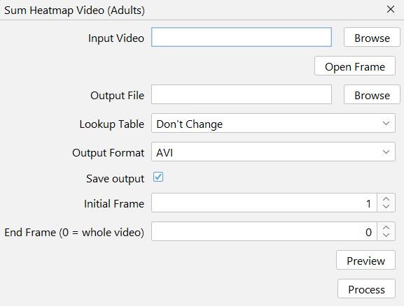

# Sum Heatmap Video

Generates a video file using pixelwise addition of the selected frames. 
Processing steps are the same as [Sum Heatmap Images](heatmap-images.md).

Each frame is then concatenated into a single video.

## Interface
{ width="400em" }

## Expected Output

--8<-- "input-video.md"

--8<-- "output-file.md"

## Lookup Table
The LUTs available are the ImageJ's built-in ones (found at Image → Lookup Tables). Leave as "Don't change" for RGB images if Convert to Grayscale is not checked.

--8<-- "start-end-frame.md"

--8<-- "preview.md"

<!--
info:
essa macro faz a mesma coisa que o heatmap images só que uma vez por frame do vídeo original.
-->
