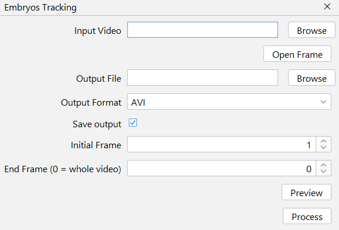

# Larvae Tracking

Pre-process the input video to make it suitable for Trackmate analysis.
These steps include frames duplication and inversion, as Trackmate algorithm recognizes white spots in a dark background.
Background subtraction trough average subtraction is also performed.

A TrackMate tutorial can be found [here](https://imagej.net/plugins/trackmate/tutorials/getting-started).

!!! Warning "FPS reduction"
    We found 20 fps to be suitable to track larvae fish movement. It's possible to change the framerate using this plugin's [FFmpeg tool](../tools/ffmpeg.md)

## Interface
{ width="400em" }










