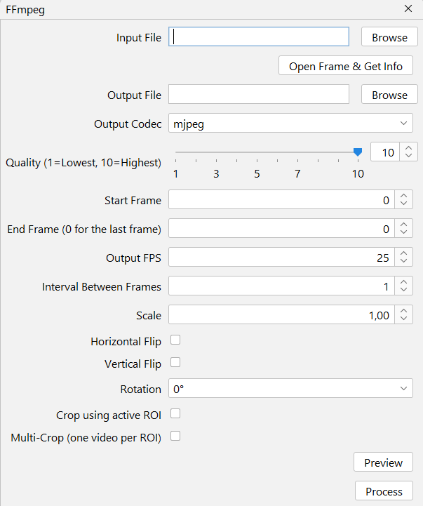

# FFmpeg

A graphical user interface to use FFmpeg. It's simplified to display only the features used in this plugin's domain.

<!-- why not use the built-in FrameRecorder? because it's much slower than the standalone binary-->

## Interface
{ width="300em" }

--8<-- "input-video.md"

--8<-- "open-frame.md"

--8<-- "output-file.md"

## Output Codec
Choose between mjpeg (AVI), libx264 (MP4) and libx265 (MP4 with better compression). ImageJ only can read AVI video files with mjpeg codec, so that's the preferred one.

## Start and End frame
Specify the frame number to begin and end the processing.

!!! warning "Zero-indexed values"
    **This field behaves differently from all other frame inputs in this plugin.** It's zero-indexed, meaning the first frame has a number value of zero.

The selection is inclusive, meaning both the start and end frames will be processed.

To process the video all the way to its final frame, enter 0 in the 'End frame' field.

## Output FPS
Frames per second rate of the output video. The "Open Frame & Get Info" button above autofills this field with the input file's frame rate.

## Horizontal Flip
Flips the video horizontally. Based on the Preview's frame position. Uses a [ffmpeg fiter](https://ffmpeg.org/ffmpeg-filters.html#hflip).

## Vertical Flip
Flips the video vertically. Based on the Preview's frame position. Uses a [ffmpeg fiter](https://ffmpeg.org/ffmpeg-filters.html#vflip).

## Rotation
Rotates the video by the set degrees amount. Based on the Preview's frame position. Uses a [ffmpeg fiter](https://ffmpeg.org/ffmpeg-filters.html#transpose).

## Crop Using Active ROI
Crops the video using the active ROI in the preview image. If not found, uses the selected one in ROI Manager. If not found, uses the first one in ROIManger.

## Multi-Crop
Creates one video for every ROI in ROI Manager. To be saved in the folder of the output file, with each ROI name appended to the file name.

## Preview
Process one frame of the input file with the selected options and displays it. Useful for making sure the rotation and crop filters are working as expected.