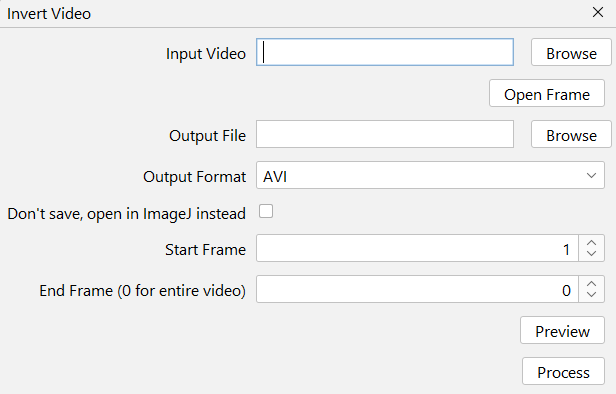

# Invert Video

Uses OpenCV and FFmpeg to invert each frame, allowing faster operation without the need to load the whole video into memory. Done as a [bitwise NOT](https://docs.opencv.org/4.x/d0/d86/tutorial_py_image_arithmetics.html) operation.

## Interface
{ width="300em" }

--8<-- "input-video.md"

--8<-- "open-frame.md"

--8<-- "output-file.md"

--8<-- "output-formats.md"

--8<-- "dont-save.md"

--8<-- "start-end-frame.md"

--8<-- "preview.md"
