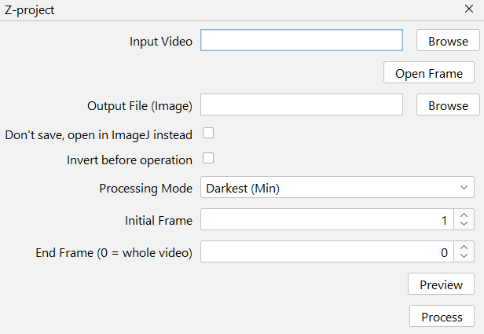

# Z-Project

## Interface
{ width="300em" }

--8<-- "input-video.md"

--8<-- "open-frame.md"

--8<-- "output-file.md"

--8<-- "dont-save.md"

--8<-- "invert-before.md"

## Processing Mode
The operations available mimic ImageJ's built-in **Image → Stacks → Z project** operations:

* Darkest (Min)
* Brightest (Max)
* Average
  * Always saved as 32-bit
* Sum
  * Always saved as 32-bit

--8<-- "start-end-frame.md"

--8<-- "preview.md"