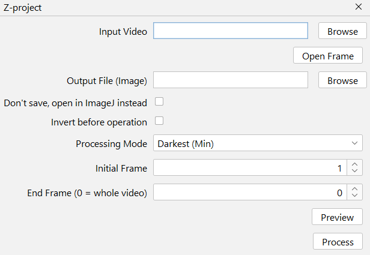

# Z-Project

## Interface
{ width="400em" }











## Processing Mode
The operations available mimic ImageJ's built-in **Image → Stacks → Z project** operations:

* Darkest (Min)
* Brightest (Max)
* Average
* Sum (saved as 32-bit)



